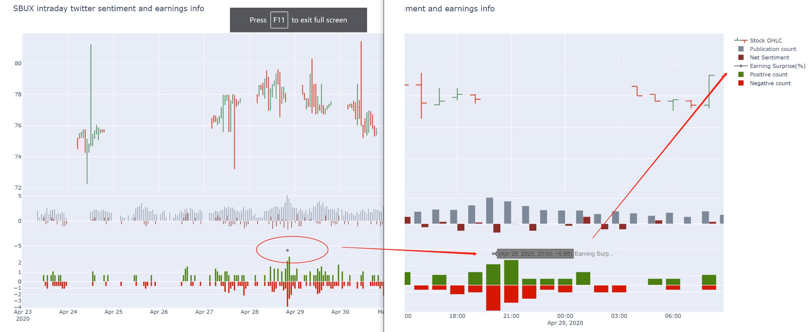
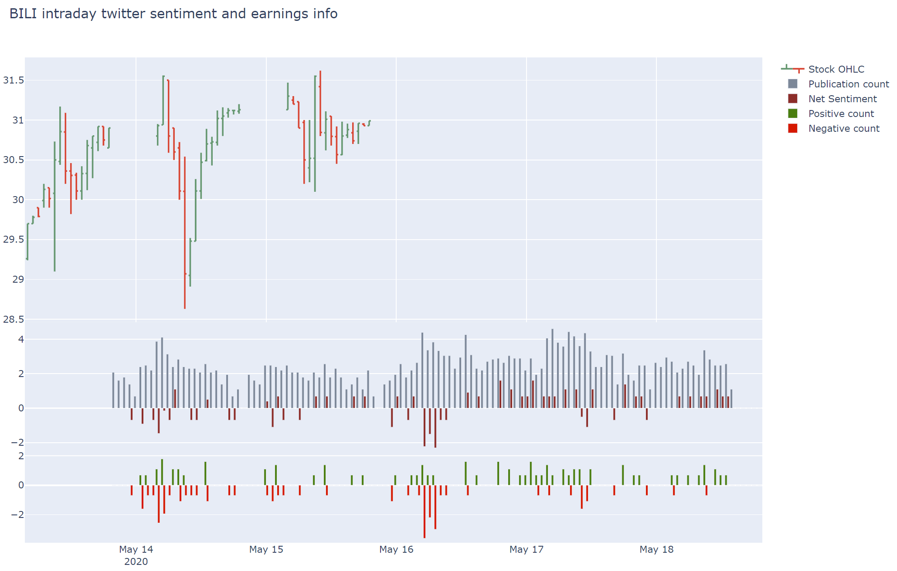

# TwitterAnalysisWithEarning

Analyze twitter sentiments towards key works related one company that are near earnings events

The analysis include three parts:

1. The Twitter sentiments before the earning release
2. The sentiments on the release date and the EPS surprise to market
3. The Twitter sentiments after the earning release, whether or not it reached the expectation

## User Instructions:

* Prerequisite tool:

  * tweepy (Python package)
  * a Twitter standard development api (free)

* Pre downloaded files are:

  * The data folder contains the stock's intraday data from wrds TAQ
  * 'LoughranMcDonald_MasterDictionary_2018.csv' is a dictionary from paper Loughran and McDonald[2018]

* How to operate the files

 * First run "twitter_scaper.py"
    the parameters are tickers one want to search
    get a folder contains all the twitters one can scrape eg. standard account means 7 days, 140 length twitter

 * Then run "twitter_analysis.py"
    parameters are ticker to analyze, and the follower threshold, defaut = 100

## Updates

* Updated 5.1.2020, version 1.1:

  1.revised the time zone issue(from UTC to EST)
  
  2.changed from twitter to tweepy library

* Updated 5.1.2020, version 1.2:

  1.added the “net sentiment” feature, which is positive count minus negative
  
  2.optimized the data processing to cut the time by 50% 

* Updated 5.3.2020, version 1.3:

  1.scraped earning date time, estimated EPS, reported EPS, EPS surprise(%)
  
  2.plot the EPS surprise(%) in the twitter net-sentiment graph

* Updated 5.5.2020, version 1.4:

  1.Stored the sentiment files in './result/ticker'
  
  2.Added the pure sentiment switch, no more stock processing(slow)

* Updated 5.17.2020, version 1.5:

  1.Added file named “earning_news_sa.py”, it searched and scraped the news from 'seekingalpha.com/market-news' containing whichever headline one feeds. It also allows searching earnings news for specific companies.
  
  2.Optimized twitter time processing
