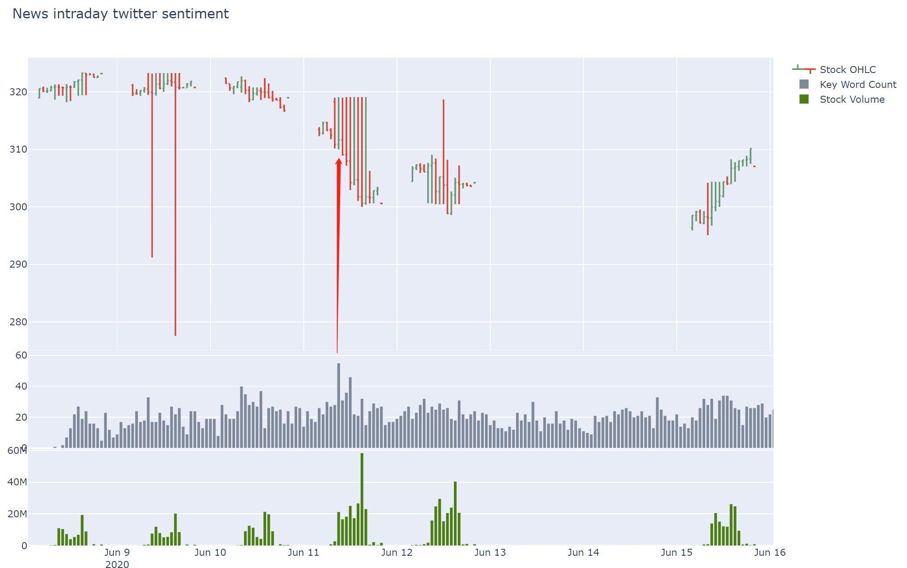
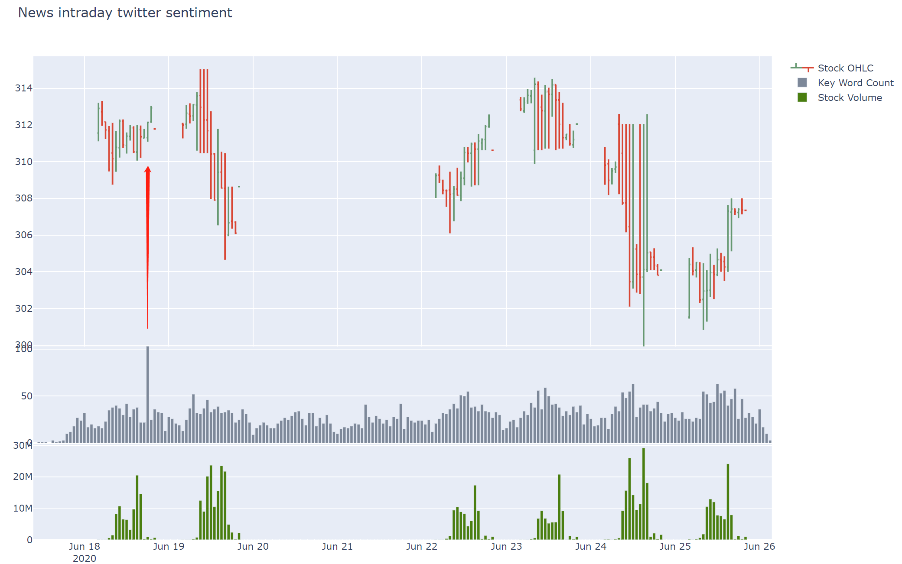
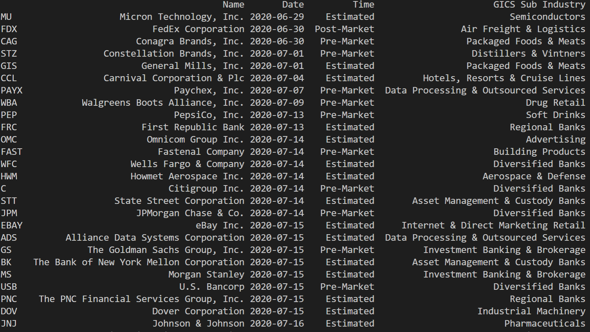

# Twitter Analysis With Earning Events

Analyze twitter sentiments towards key works related one company that are near earnings events

The analysis include three parts:

1. The Twitter sentiments before the earning release
2. The sentiments on the release date and the EPS surprise to market
3. The Twitter sentiments after the earning release, whether or not it reached the expectation

## Main Functions

Function 1: get raw tweets related to one keyword and store the files by date

Function 2: analyze the stored files from function 1 and visualize the result

Function 3: get news from specific 30 major new press twitter accounts 

Function 4: analyze the result from function 3 and visualize the result

Function 5: get ticker names which have earning event in next n days

## Demo

**Function 1 & 2 result :**

Key word is SBUX and BILI, searched all tweets for the period when their earning was released, compared to their intraday stock price:

**Function 3 & 4 result:**

Get all tweets from certain mainstream press accounts including CNN, Fox News, etc. then count tweets number containing certain key words including Corona, COVID or pandemic, then compare it with SPY intraday graph:  

**Function 5 result:**

Get all names listed in S&P500 that have earning events in next period of time(from Yahoo Finance).

## Instructions

* Prerequisite tool:

  * **tweepy** (Python package)
  * a Twitter standard development account api (free)
  * store the consumer_key, consumer_secret, access_token_key, access_token_secret from the account above in a file named *TOKEN.TXT* in root path separated by space

* Pre downloaded files are:

  * The data folder contains the stock's intraday data from *wrds* TAQ database
  * *LoughranMcDonald_MasterDictionary_2018.csv* is a dictionary from paper Loughran and McDonald[2018]

* How to operate the files

  * open *menu.py*
  * choose functions you want to run, there are 5 major functions to choose from

## Updates

* Updated 5.1.2020, version 1.1:

  1.revised the time zone issue(from UTC to EST)
  
  2.changed from twitter to tweepy library

* Updated 5.2.2020, version 1.2:

  1.added the “net sentiment” feature, which is positive count minus negative
  
  2.optimized the data processing to cut the time by 50% 

* Updated 5.3.2020, version 1.3:

  1.scraped earning date time, estimated EPS, reported EPS, EPS surprise(%)
  
  2.plot the EPS surprise(%) in the twitter net-sentiment graph

* Updated 5.5.2020, version 1.4:

  1.stored the sentiment files in './result/ticker'
  
  2.added the pure sentiment switch, no more stock processing(slow)

* Updated 5.17.2020, version 1.5:

  1.added file named “earning_news_sa.py”, it searched and scraped the news from 'seekingalpha.com/market-news' containing whichever headline one feeds. It also allows searching earnings news for specific companies.

  2.optimized twitter scraping process

- Updated 5.29.2020, version 1.6:

   1.broke down the functions into different files to get better management

   2.add "top_word" function to get the top frequency words for each keyword analysis

- Updated 5.30.2020, version 1.7:

    1.added 'twitter_stats.py' files that gives basic twitter statistics in a simple digit form instead of a graph, such as daily tweets numbers and daily unique twitter accounts

    2.show estimated earning report coming in a week or in the past week in the graph

- Updated 6.10.2020, version 1.8:

    1.added new filter method as frequency of user tweets, stored as myfilter.py

- Updated 6.16.2020, version 1.9：

    1.changed the save sentiment file together for one ticker instead of one file for one date

    2.twitter_stats.py have function that separate the net sentiment to 5 parts and calculated the net sentiment divided by the total amount of tweets

- Updated 6.24.2020, version 2.0：

  1.redesigned the code structure: keep the non-main function in separate files

  2.added new features that allows to get news from specific major press twitter account and analyze keyword volume (e.g. COVID), and compare it with index intraday price, then visualize it.

