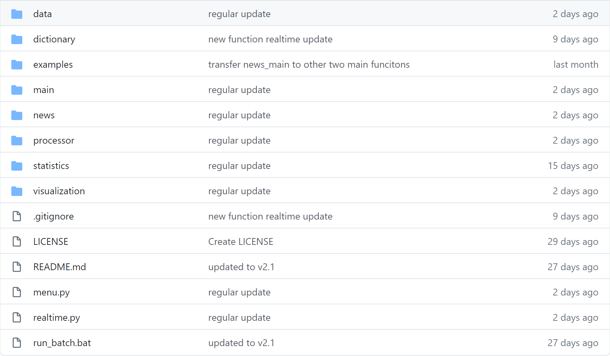
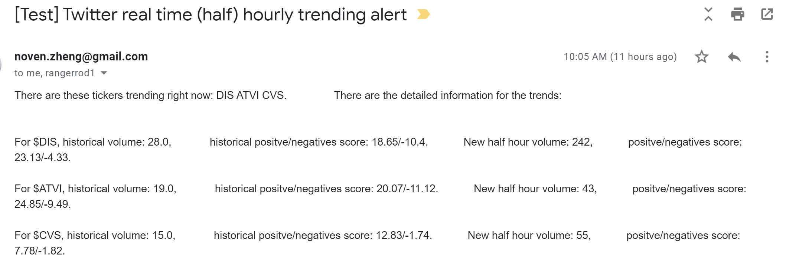

# Twitter Analysis With Earning Events

With NLP techniques, the program can analyze the positive and negative sentiments of tweets that contain certain keywords as an indicator of potential price jumps, especially used for pre-earning period. It can also real-time filter the tickers who have strong Twitter volume increase from large ticker pool and send the alert information to multiple email addresses.

## Main Functions

**Function 1**: search raw tweets related to keyword (e.g. TSLA) and store the files by date and analyze the results then visualize the positive or negative sentiment of the tweets with related stock prices, which works as an indicator of potential earning result or price move direction, especially before earning events.

**Function 2**: get news from specific 30 mainstream news press twitter accounts and store them by date and analyze number of news containing keywords (e.g. COVID) then visualize the result with related prices (e.g. SPY)

**Function 3**: save ticker names which have earning event in next n days, and sparse the news related to the ticker from seekingalpha.com

**Function 4**: real-time update the ticker names from specific ticker pool (e.g. S&P 500) which have increasing Twitter volume and their trending detailed information as an indicator of potential large price move, and send the alert information directly to users' email. The tickers names pool is parsed by function3 at each weekend.

## Program Structure

The program consists of 4 major modules: processor, statistics, news and visualization; 2 main py files: **menu.py** and **realtime.py**. In each of the modules, several internal python files have their own functions.

## User Instruction and Parameter setting

Function 1,2 and 3 are located in menu.py, function 4 is in realtime.py. To use each function, run the py file with the one function uncommented.

### Menu

##### Function1:

Major parameters: 

1. list of tickers
2. dates to lookback
3. whether to save the result
4. whether to plot
5. whether to scale the result with logarithm
6. whether to plot stock price with sentiment 
7. whether to parse earning date for each ticker
8. whether to get only the pre-open sentiment
9. whether to send the result to certain email address
10. follower threshold

##### Function2:

Major parameters: 

1. dates to lookback
2. file name that to be saved
3. keywords need to be counted

##### Function3:

Major parameters: 

1. dates to lookback
2. index name pool

### Realtime

##### Function4:

Major parameters: 

1. testing timing (default: xx:00 and xx:30) 
2. index name pool (default: names that have earning event in the following week)
3. alert trigger condition (default: the new half hour volume larger than 2 times of the half-hour average volume)
4. alert information in email body (default: historical and new volume, positive and negative scores of the historical and new tweets)
5. alert receiver email address (default: wz1298@nyu.edu)

## Function Demo

**Function 1:**

Key word is SBUX and BILI, searched all tweets for the period when their earning was released, compared to their intraday stock price:

**Function 2:**

Get all tweets from certain mainstream press accounts including CNN, Fox News, etc. then count tweets number containing certain key words including Corona, COVID or pandemic, then compare it with SPY intraday graph: 

**Function 3:**

Get all names listed in S&P500 that have earning events in next period of time(from Yahoo Finance).

**Function4:**

The email body contains three ticker names that have high Twitter volume in the past half hour.

## Instructions

* Prerequisite tool:

  * **tweepy** (Python package)
  * a Twitter standard development account api (free)
  * store the consumer_key, consumer_secret, access_token_key, access_token_secret from the account above in a file named *TOKEN.TXT* in root path separated by space

* Pre downloaded files are:

  * The data folder contains the stock's intraday data from *wrds* TAQ database
  * *LoughranMcDonald_MasterDictionary_2018.csv* is a dictionary from paper Loughran and McDonald[2018]

* How to operate the files

  * open *menu.py*
  * choose functions you want to run, there are 3 major functions to choose from

## Updates

* Updated 5.1.2020, version 1.1:

  1.revised the time zone issue(from UTC to EST)
  
  2.changed from twitter to tweepy library

* Updated 5.2.2020, version 1.2:

  1.added the “net sentiment” feature, which is positive count minus negative
  
  2.optimized the data processing to cut the time by 50% 

* Updated 5.3.2020, version 1.3:

  1.scraped earning date time, estimated EPS, reported EPS, EPS surprise(%)
  
  2.plot the EPS surprise(%) in the twitter net-sentiment graph

* Updated 5.5.2020, version 1.4:

  1.stored the sentiment files in './result/ticker'
  
  2.added the pure sentiment switch, no more stock processing(slow)

* Updated 5.17.2020, version 1.5:

  1.added file named “earning_news_sa.py”, it searched and scraped the news from 'seekingalpha.com/market-news' containing whichever headline one feeds. It also allows searching earnings news for specific companies.

  2.optimized twitter scraping process

- Updated 5.29.2020, version 1.6:

   1.broke down the functions into different files to get better management

   2.add "top_word" function to get the top frequency words for each keyword analysis

- Updated 5.30.2020, version 1.7:

    1.added 'twitter_stats.py' files that gives basic twitter statistics in a simple digit form instead of a graph, such as daily tweets numbers and daily unique twitter accounts

    2.show estimated earning report coming in a week or in the past week in the graph

- Updated 6.10.2020, version 1.8:

    1.added new filter method as frequency of user tweets, stored as myfilter.py

- Updated 6.16.2020, version 1.9：

    1.changed the save sentiment file together for one ticker instead of one file for one date

    2.twitter_stats.py have function that separate the net sentiment to 5 parts and calculated the net sentiment divided by the total amount of tweets

- Updated 6.24.2020, version 2.0：

  1.redesigned the code structure: keep the non-main function in separate files

  2.added new features that allows to get news from specific major press twitter account and analyze keyword volume (e.g. COVID), and compare it with index intraday price, then visualize it.

- Updated 6.24.2020, version 2.1：

  1.add auto email system that enable running the program at any given time automatically and at the same time the email would be sent to specific email address.

- Updated 8.4.2020, version 2.2：

  1.add function that can real-time update the ticker names from specific ticker pool (e.g. S&P 500) which have increasing Twitter volume and their trending detailed information as an indicator of potential large price move, and send the alert information directly to users' email. The tickers names pool is parsed by function3 at each weekend.